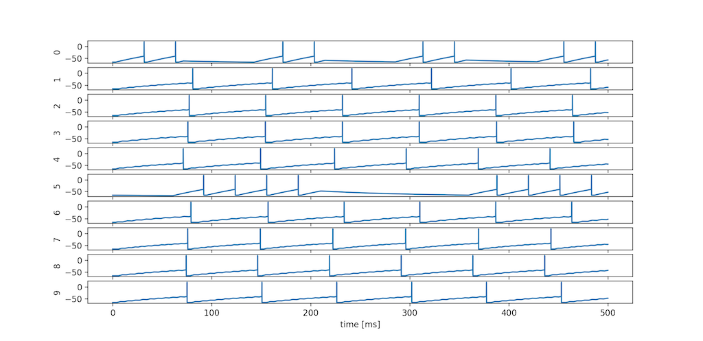
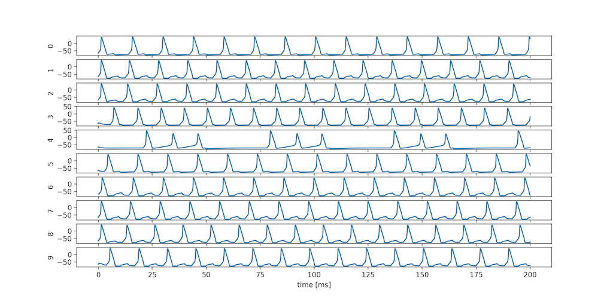

# SPINE: Spiking Neuron simulator
  
  
<p align="center"></p>
  
SPINE is a simple Spiking Neuron simulator.  
[http://spine.hirlab.net](http://spine.hirlab.net) (japanese docs)
 
## Line-up
### LIF: Leaky integrate-and-fire model
```bash
$ cd spine
$ python lif.py
```


### Hodgkin-Huxley model
```bash
$ cd spine
$ python hh.py
```


### FitzHugh-Nagumo model
```bash
$ cd spine
$ python fhn.py
```


## Example
```python
from spine import HodgkinHuxley
import numpy as np


if __name__ == '__main__':

    neu = HodgkinHuxley(time=100, dt=0.01)

    input_data = np.sin(0.5 * np.arange(0, neu.time, neu.dt))
    input_data = np.where(input_data > 0, 20, -5) + 10 * np.random.rand(int(neu.time / neu.dt))

    neu.calc_v(input_data)

    neu.plot_monitor()
```


## Example 2
You can simulate neurons' activities as a layer.
```python
# LIF model
from spine import Layer
import numpy as np
import matplotlib.pyplot as plt


if __name__ == '__main__':
    time = 500
    dt = 0.1

    layer = Layer(n=10, model='lif', time=time, dt=dt)

    input_data = [
        np.where(np.sin(np.random.rand() * np.arange(0, time, dt) + o) > 0, 100, -5) for o in range(10)
    ]

    input_data = np.array(input_data)
    v = layer.calc_v(input_data)

    print(np.array(v).shape)

    for i, d in enumerate(v):
        plt.subplot(10, 1, i+1)
        plt.plot(np.arange(0, time, dt), d)
        plt.ylabel(i)

    plt.xlabel('time [ms]')
    plt.show()

```

  

```python
# Hodgkin-Huxley
from spine import Layer
import numpy as np
import matplotlib.pyplot as plt


if __name__ == '__main__':
    time = 200
    dt = 0.01

    # Construct a layer
    layer = Layer(n=10, model='hh', time=time, dt=dt)

    # Random Square waves as input data
    input_data = [
        np.where(np.sin(np.random.rand() * np.arange(0, time, dt) + o) > 0, 20, -5) for o in range(10)
    ]

    input_data = np.array(input_data)
    
    # calc membrane potentials
    v = layer.calc_v(input_data)

    # plot
    for i, d in enumerate(v):
        plt.subplot(10, 1, i+1)
        plt.plot(np.arange(0, time, dt), d)
        plt.ylabel(i)

    plt.xlabel('time [ms]')
    plt.show()

```


## LICENSE
[MIT LICENSE](LICENSE.txt)  
Copyright (c) 2020 Hiroshi ARAKI