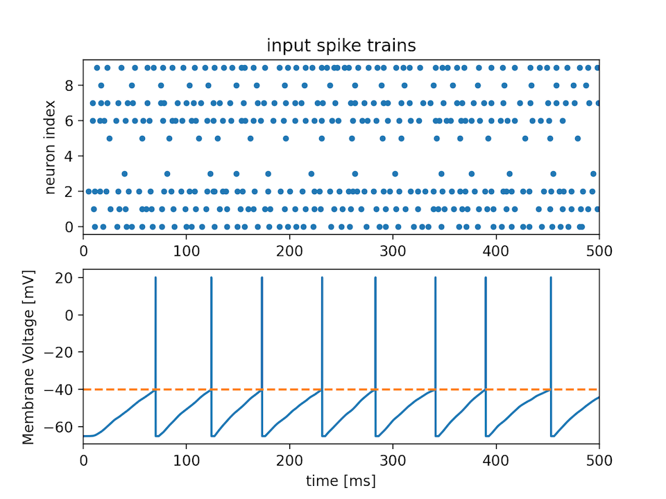

# SPINE: Spiking Neuron simulator

  
  
<p align="center"></p>
  
SPINE is a simple Spiking Neuron simulator.  
Documentation is   
[http://spine.hirlab.net](http://spine.hirlab.net) (japanese docs)  
or  
please refer to `***_sample.py`.
 
## Line-up
### IF: integrate-and-fire model
```python
from spine import IF
neu = IF(time=300,
         dt=0.1,
         k='double',  # use double exponential filter
         tau=(10, 2)  # time constants of filter
         )
```
* Example
   ```shell script
    $ python if_sample.py
    ``` 
    
### LIF: Leaky integrate-and-fire model
```python
from spine import LIF
neu = LIF(time=300,
          dt=0.1,
          k='double',  # use double exponential filter
          tau=(10, 2)  # time constants of filter
          )
```
* Example
    ```shell script
    $ python lif_sample.py
    ```
    

### Hodgkin-Huxley model
```shell script
$ python hh_sample.py
```


### FitzHugh-Nagumo model
```shell script
$ python fhn_sample.py
```


## Generate Poisson Spike train and a plotting function
```python
from spine import PoissonSpike
from spine.tools.plotting import plot_spike_scatter

import numpy as np
import matplotlib.pyplot as plt

spikes = PoissonSpike(np.random.random((10, 10)), time=300, dt=0.1).spikes
plot_spike_scatter(spikes, time=300, dt=0.1)
plt.title('Spike firing timing')
plt.show()
```


## LICENSE
[MIT LICENSE](LICENSE.txt)  
Copyright (c) 2020 Hiroshi ARAKI