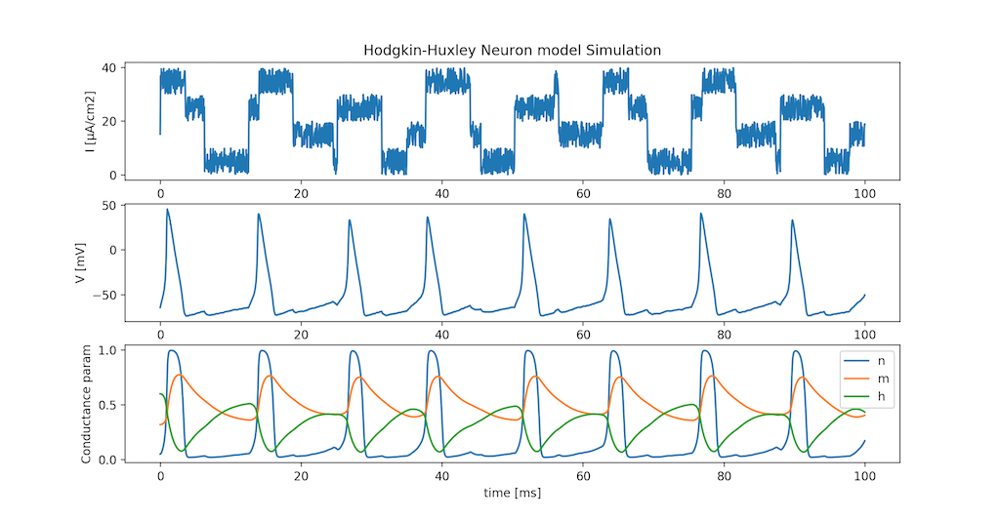

# SPINE: Spiking Neuron simulator
  
  


  
SPINE is a simple Spiking Neuron simulator.  
[http://spine.hirlab.net](http://spine.hirlab.net) (japanese docs)
 
## Line-up
### LIF: Leaky integrate-and-fire model
```bash
$ cd spine
$ python lif.py
```


### Hodgkin-Huxley model
```bash
$ cd spine
$ python hh.py
```


### FitzHugh-Nagumo model
```bash
$ cd spine
$ python fhn.py
```


## Example
```python
from spine import HodgkinHuxley
import numpy as np


if __name__ == '__main__':

    neu = HodgkinHuxley(time=100, dt=0.01)

    input_data = np.sin(0.5 * np.arange(0, neu.time, neu.dt))
    input_data = np.where(input_data > 0, 20, -5) + 10 * np.random.rand(int(neu.time / neu.dt))

    neu.calc_v(input_data)

    neu.plot_monitor()
```


## LICENSE
[MIT LICENSE](LICENSE.txt)  
Copyright (c) 2020 Hiroshi ARAKI