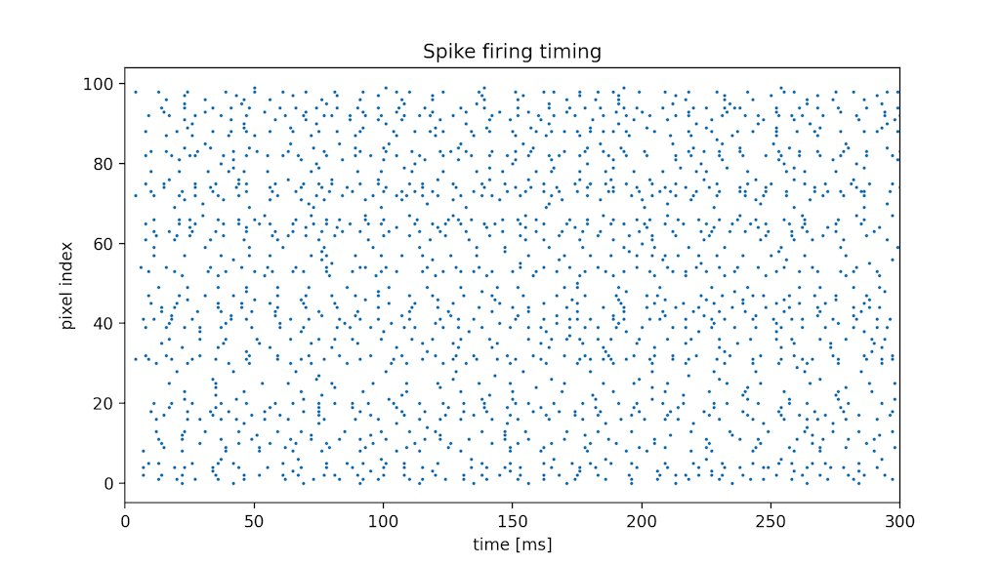

# SPINE: Spiking Neuron simulator

  
  
<p align="center"></p>
  
SPINE is a simple Spiking Neuron simulator.  
 
## Line-up
### LIF: Leaky integrate-and-fire model
```python
from spine import LIF
from spine.tools import PoissonSpike, plot_spike_scatter, random

import numpy as np
import matplotlib.pyplot as plt


if __name__ == '__main__':
    time = 500  # ms
    dt = 0.5  # time step

    pre_neurons = 100

    # Input data from Poisson Spike Gen.
    spikes = PoissonSpike(np.random.random(pre_neurons),
                          time=time,
                          dt=dt).spikes

    # random weights whose size is the same as spikes
    weights = random.U(pre_neurons, -0.05, 0.1)  # U[-0.05, 0.1]

    neu = LIF(time=time,
              dt=dt,
              tau=(10, 2)  # time constants of filter
              )

    v, s, f = neu.calc_v((spikes, weights))

    # Plot
    t = np.arange(0, time, dt)

    plt.subplot(2, 1, 1)
    plot_spike_scatter(spikes, time, dt, title='input spike trains', xlabel=None)

    plt.subplot(2, 1, 2)
    plt.plot(t, v)
    plt.plot(t, np.full_like(t, neu.th), linestyle='dashed')
    plt.ylabel('Membrane Voltage [mV]')
    plt.xlabel('time [ms]')
    plt.xlim(0, time)

    plt.show()

```
* Example
    ```shell script
    $ python lif_sample.py
    ```
    

### Hodgkin-Huxley model
```shell script
$ python hh_sample.py
```


### FitzHugh-Nagumo model
```shell script
$ python fhn_sample.py
```


### Izhikevich model
```shell script
$ python izh_sample.py
```


## Generate Poisson Spike train and a plotting function
```python
from spine.tools import PoissonSpike, plot_spike_scatter

import numpy as np
import matplotlib.pyplot as plt

spikes = PoissonSpike(np.random.random((10, 10)), time=300, dt=0.1).spikes
plot_spike_scatter(spikes, time=300, dt=0.1)
plt.title('Spike firing timing')
plt.show()
```


## LICENSE
[MIT LICENSE](LICENSE.txt)  
Copyright (c) 2020 Hiroshi ARAKI